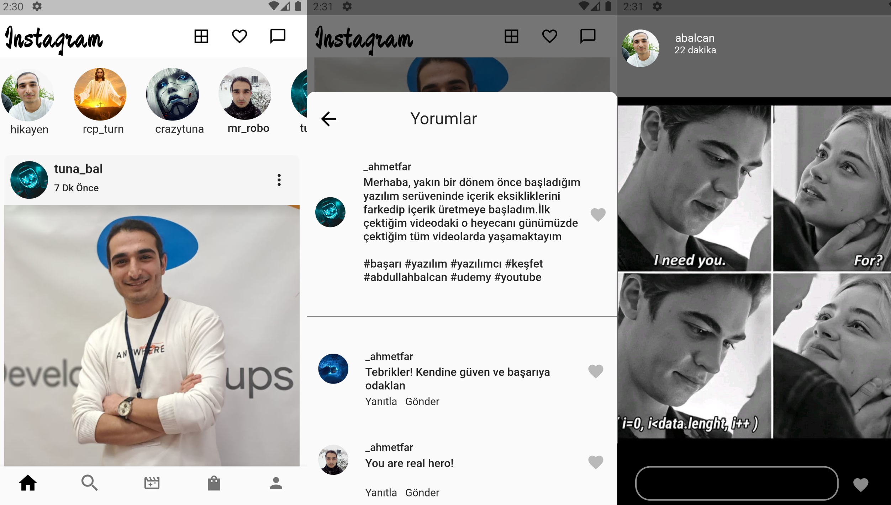

 # Temel Instagram Uygulaması

 
 ## Projenin Amacı ve Özelliği
 Instagram uygulamasının arayüzünü tasarlamak ; hikaye resimlerini, gönderi resimlerini ve temel bilgileri Firebase veri tabanına kaydetmek ve bunları veri tabanından çekmeyi gerçekleştirmek
  
 <ul>
 <li>Login Sayfası (Yeni Üye Kayıt,Giriş Yap)</li>
 <li>Veritabanı üye kayıt/üye sorgulama işlemleri</li>
 <li>Kullanıcıya ve arkadaşlara ait profil sayfaları</li>
 <li>Kullanıcıya ve arkadaşlara ait resimler,gönderi ve hikaye resimleri ve temel bilgiler</li>
 <li>Kullanıcı bilgi düzenleme sayfası</li>
 <li>Keşfet ve mesajlaşma sayfa tasarımı</li>
 </ul>
